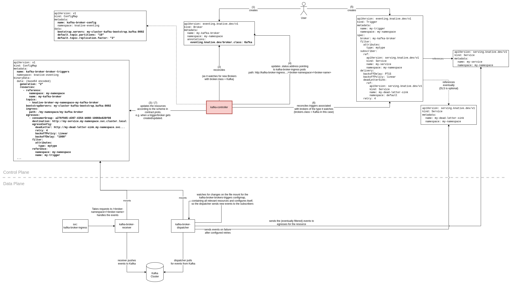

# Knative Eventing Broker for Apache Kafka

This document gives a rough overview over the architecture of the Knative Eventing Broker for Apache Kafka.

## Control Plane

The `kafka-controller` is kind of the heart of the Broker for Apache Kafkas control plane and has the following responsibilities:

* Watch the following resources and update the `kafka-broker-brokers-triggers` configmap (step 3 in the diagram) with relevant information about the resource:
  * `Broker`s with the `eventing.kantive.dev/broker.class: Kafka` annotation (step 2 in the diagram),
  * `Trigger`s referencing a Knative Eventing Broker for Apache Kafka,
  * `KafkaChannel`s,
  * `KafkaSink`s 
  * `KafkaSource`s
* Update the status on `Broker` resources with the `eventing.kantive.dev/broker.class: Kafka` annotation with the address for the broker ingress.

The `kafka-broker-brokers-triggers` configmap holds the information about the resources in the [contract.proto](https://github.com/knative-sandbox/eventing-kafka-broker/blob/main/proto/contract.proto) schema, so it can easily be read by other components (e.g. from the data plane).

## Data Plane

The data plane of the Knative Eventing Broker for Apache Kafka exists of two main components: `kafka-broker-receiver` and `kafka-broker-dispatcher`.

### kafka-broker-receiver

The `kafka-broker-receiver` takes requests for new CloudEvents and persists them in an Apache Kafka Topic. It gets the topic name for the corresponding Knative Eventing Broker from the volume mounting the `kafka-broker-brokers-triggers` configmap.

### kafka-broker-dispatcher

The `kafka-broker-dispatcher` polls periodically Apache Kafka for new messages, wraps them into CloudEvents, eventually filters them and sends them to the egresses of the broker resource (an egress can be a Subscriber of the broker for example). It gets the list of egresses from the volume mounting the `kafka-broker-brokers-triggers` configmap.
